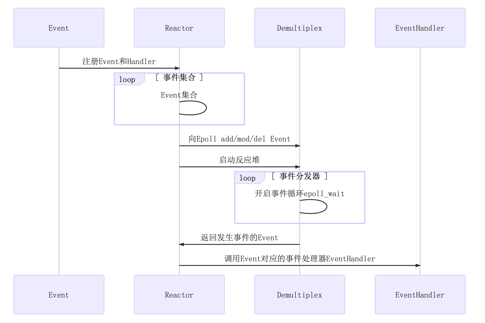
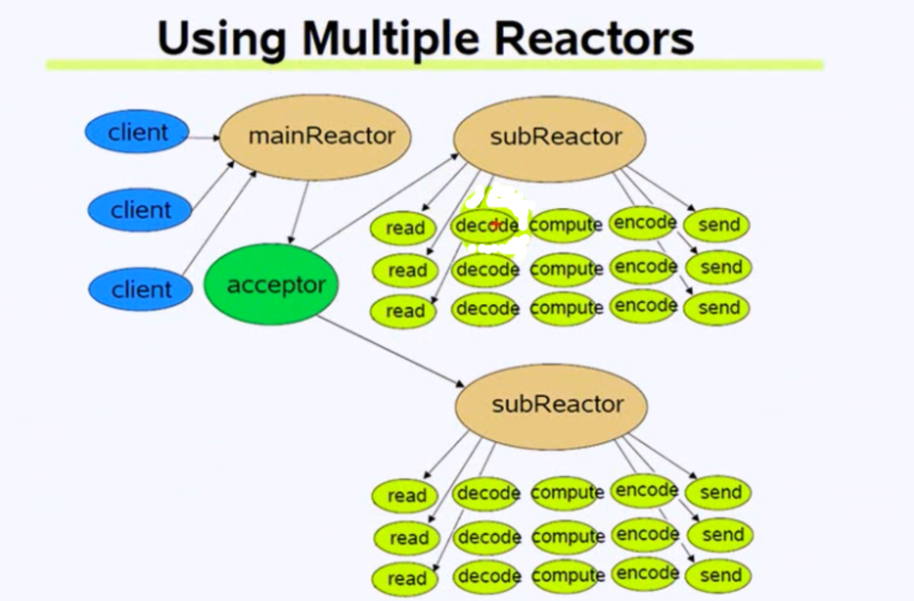

## 项目介绍
### Reactor模型


### 网络库的Multiple Reactors模型如下:


#### 网络库采用的是LT模式
- 不会丢失数据或者消息
    应用没有读取完数据，内核是会不断上报的
- 低延迟处理
     每次读数据只需要一次系统调用;照顾了多个连接的公平性，不会因为某个连接上的数据量过大而影响其他连接处理消息
- 跨平台处理
    像`select`一样可以跨平台使用

### 网络库网络库的核心代码模块

#### Channel
`fd、events、revents、callbacks`
两种`channel`: `listenfd-acceptorChannel`和`connfd- connectionChannel`

### Poller和EPollPoller -- Demultiplex
`std::unordered_map<int, Channel*> channels`

### EventLoop -- Reactor
`ChannelList activeChannels_` `std::unique_ptr poller_`
`int wakeupFd -> loop`
`std::unique_ptr wakeupChannel_`

### EventLoopThreadPool
`getNextLoop()`: 通过轮询算法获取下一个`subloop` => `baseLoop`
一个thread对应一个`loop` => `one loop per thread`

### Acceptor
主要封装了`listenfd`相关的操作：`socket bind listen baseLoop`

### Buffer
缓冲区应用写数据 -> 缓冲区 -> `Tcp`发送缓冲区 -> `send`
`prependable--readeridx--writeridx`


### TcpConnection
一个连接成功的客户端对应一个`TcpConnection` `Socket Channel`各种回调发送和接收缓冲区

### TcpServer
`Acceptor EventLoopThreadPool`
`ConnectionMap connections_`

### 项目编译
- 自动编译：`./autobuild.sh`
- 手动编译:
```
mkdir -p build
cd build
cmake ..
make
sudo make install
```